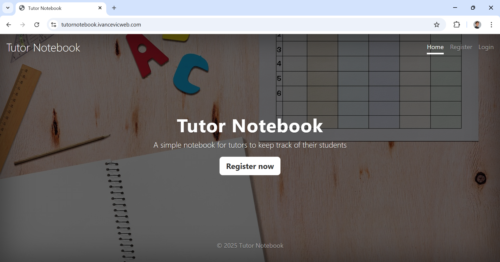
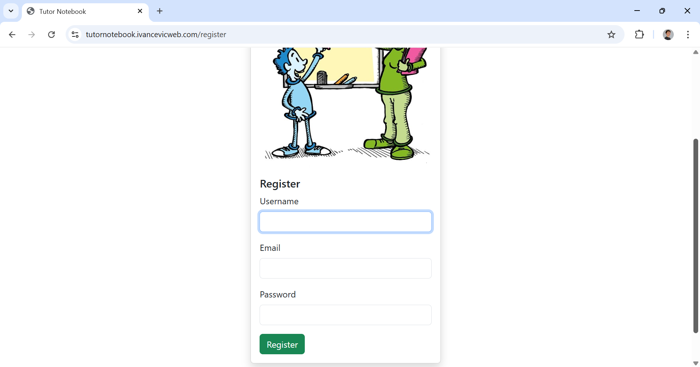
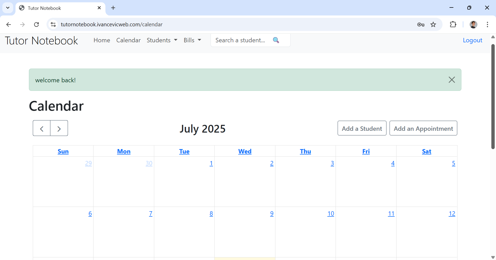
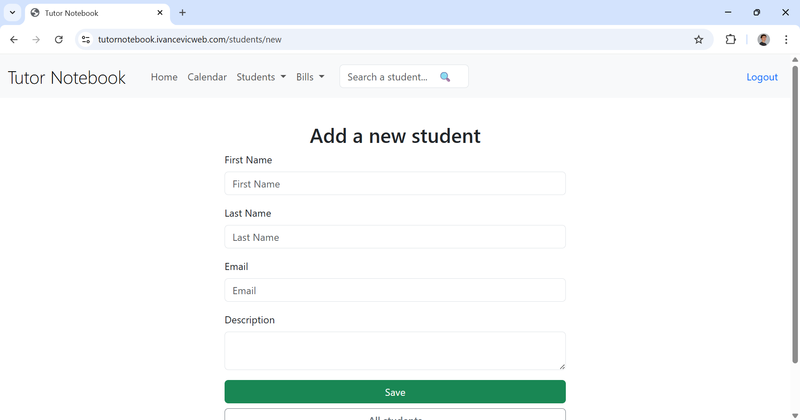
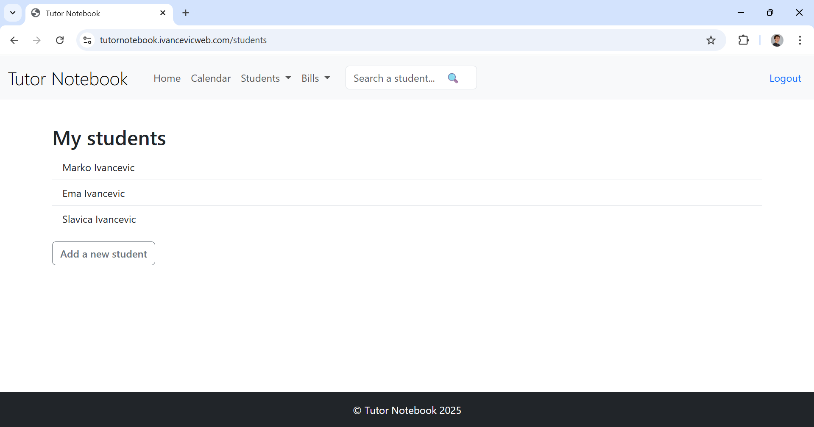
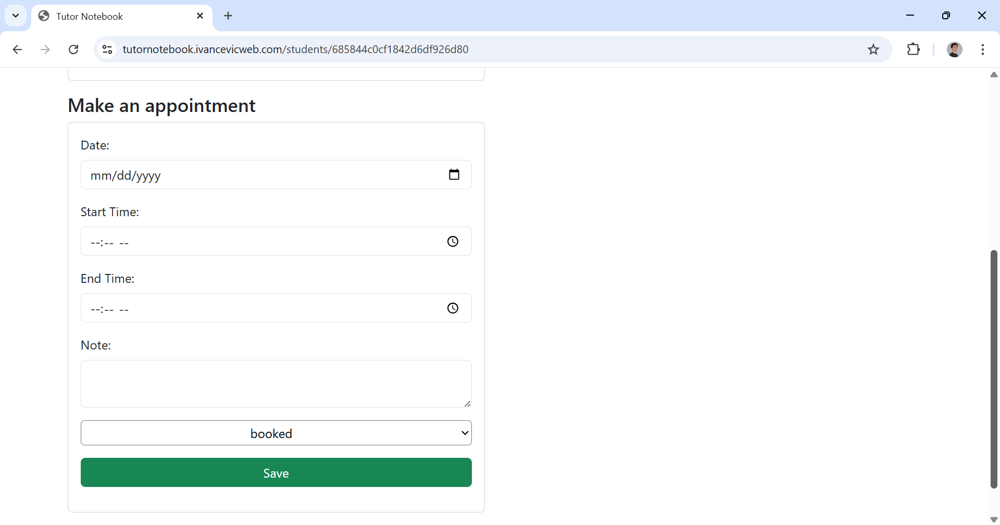
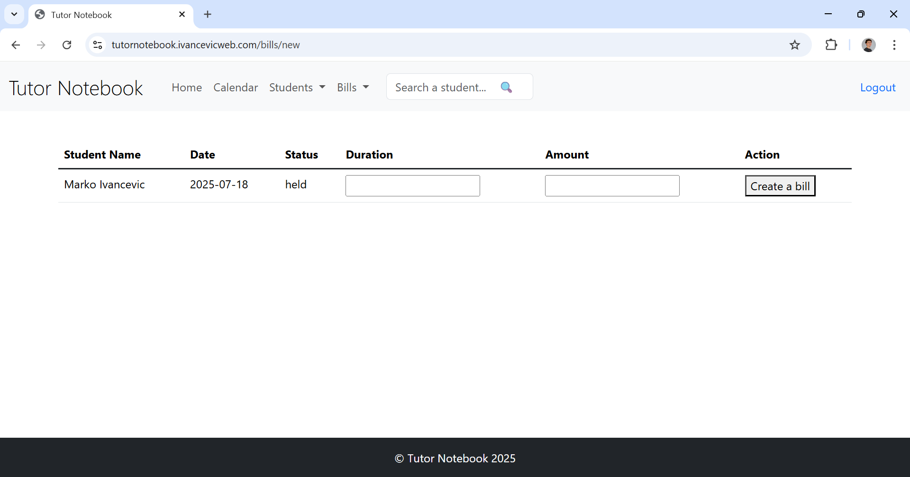
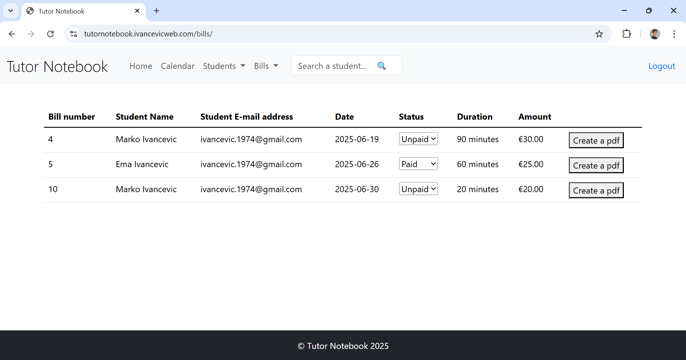

# Tutor Notebook
A secure and user-friendly platform for trainers to manage students, appointments, and invoices.

## Table of Contents
- [Features](#features)
- [Tech Stack](#tech-stack)
- [Screenshots](#screenshots)
- [Installation](#installation)
- [Usage](#usage)
- [Security](#security)
- [License](#license)

## Features
- 🧑‍🏫 User Management: Register, log in, and reset password for trainers.
- 👨‍🎓 Student Management: Add, edit, and delete student records.
- 📅 Appointment Scheduling: Organize and manage appointments via calendar.
- 📄 Invoicing: Generate and track invoices based on provided sessions.

## Tech Stack
**Frontend**: Vanilla JavaScript  
**Backend**: Node.js, Express  
**Database**: MongoDB   
**Password Security**: bcrypt  

## Screenshots









## Live Demo
👉 [Try it here](https://tutornotebook.ivancevicweb.com)

## Docker Image
```bash
 docker push slavicai/tutor-notebook:tagname
 ```

## Installation

Clone the repo  
```bash
git clone https://github.com/slavicarab/tutor-notebook.git
npm install
npm start
```

---

### **Usage**
How to use the app once it’s running.


## Usage
- Register as a new trainer
- Log in securely
- Add students and schedule sessions
- Generate and download invoices

## Security
- Passwords are hashed with bcrypt

## License
[MIT](LICENSE)


